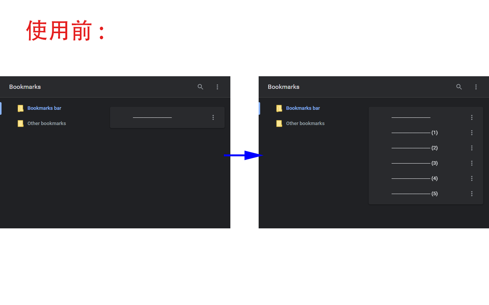
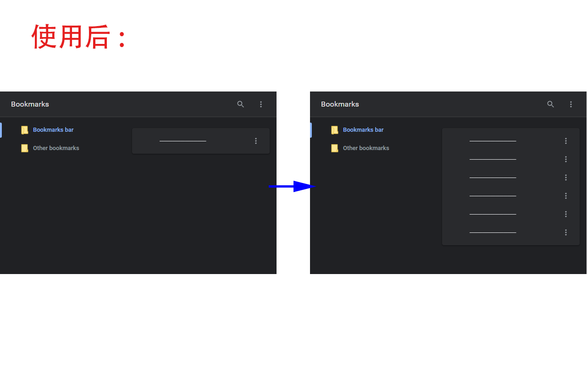

#  Disable Bookmark Index

## 作用

当在书签处理器中直接复制并粘贴书签时，新书签会自动添加索引值，而本扩展程序将禁止这种行为。

例如直接复制并粘贴分隔符 [chrome-separators](https://github.com/skrysmanski/chrome-separators)：

# 

# 

## 安装方法

1. 前往[应用商店](https://chrome.google.com/webstore/detail/blacgmpghkgcceodmlialgningohipab)下载安装。

2. 手动加载：

启动浏览器在地址栏内输入 `chrome://extensions/` 进入扩展程序管理页面，点击网页右上角的开关以开启"开发者模式"。

a. 前往 [Releases](https://github.com/LightAPIs/my-separator/releases/latest) 下载 `crx` 扩展程序文件并拖动至扩展程序管理页面安装。

b. 前往 [Releases](https://github.com/LightAPIs/my-separator/releases/latest) 下载扩展程序压缩包 `zip` 文件并进行解压得到某个空文件夹中，然后点击"加载已解压的扩展程序"按钮，选择加载先前解压到的文件夹即可(之后请保留该文件夹，**不要删除**)。

---

## 许可证

[MIT](/LICENSE) License
